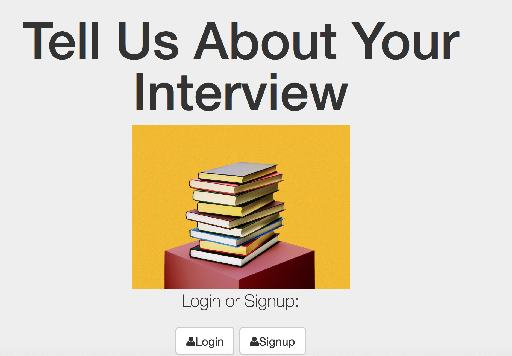

# Interview
This web application gives the user the ability to log into their own account and leave a message about their experience in a recent interview. The user has the ability to favorite messages and delete their message.

## How It's Made:

**Tech used:** ejs, CSS, JavaScript, NodeJS and stored on MongoDB

In this web app I sorted in descending order the users comment so that the most recent comment would be seen above the others. I added a date so that it was certain to others that the comment would appear up top.

## Installation

1. Clone repo
2. run `npm install`

## Usage

1. run `node server.js`
2. Navigate to `localhost:8080`
